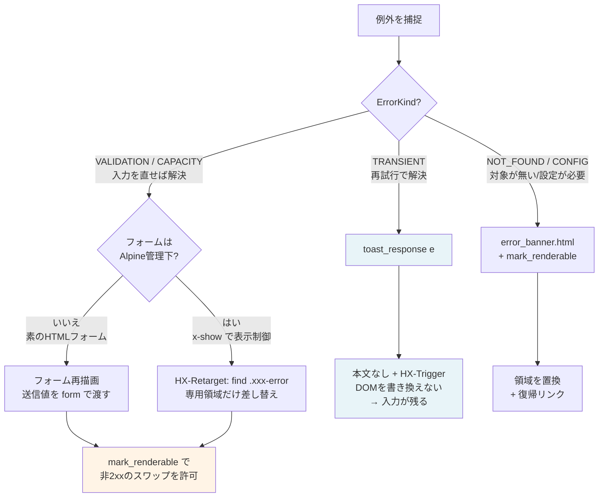

---
paths:
  - "src/models/errors.py"
  - "src/services/**/*.py"
  - "src/managers/**/*.py"
  - "web/routers/**/*.py"
  - "web/error_messages.py"
  - "web/main.py"
  - "web/templates/**/*.html"
  - "tests/api/test_error_exposure.py"
  - "tests/unit/test_error_messages.py"
  - "tests/unit/test_error_kinds.py"
---

# エラーカタログ設計

例外の送出から画面表示までの規約。`.claude/rules/architecture.md`（層の依存方向・責務）から分離したのは、
エラー設計だけで規約全体の3分の2を占め、アーキテクチャ制約の見通しを損なっていたため。

設計の背景・検討経緯は `docs/note/exception-message-design.md` を参照。

---

## 全体像

**原則: 例外メッセージは開発者のもの、ユーザー向け文言はプレゼンテーション層のもの。**

```
┌─ Service層 ─────────────────────────────────────────────────┐
│  外部SDK例外 → 自ドメイン例外 + ErrorCode                     │
│  メッセージは技術的事実のみ（英語可）                          │
│  raise SurveyBatchServiceError(                              │
│      "batch job ended with status Failed",   ← ログ用         │
│      code=ErrorCode.SURVEY_BATCH_JOB_FAILED) from e          │
└──────────────────────────┬──────────────────────────────────┘
                           │ 例外（コード付き）
┌─ Manager層 ──────────────▼──────────────────────────────────┐
│  コードを決定し、文言に必要な値を context に載せる             │
│  ※ 文言そのものを組み立ててはならない                         │
│  raise SurveyExecutionValidationError(                       │
│      "only 30 personas match the filters",                   │
│      code=ErrorCode.SURVEY_AVAILABLE_PERSONAS_TOO_FEW,       │
│      context={"available_count": 30, "min_count": 100})      │
└──────────────────────────┬──────────────────────────────────┘
                           │ 例外（コード + context）
┌─ Router層 ───────────────▼──────────────────────────────────┐
│  コードを引いて文言にするだけ。表示方法は kind で決める        │
│  user_message_for(e) / is_transient(e) / field_of(e)         │
│  ※ str(e) / {e} / e.args / 例外の属性を書いてはならない       │
└──────────────────────────┬──────────────────────────────────┘
                           │ 文言 + 表示方法
                    ┌──────▼──────┐
                    │   画面表示    │
                    └─────────────┘
```

各層の持ち物:

| 層 | ファイル | 持つもの |
|---|---|---|
| Models | `src/models/errors.py` | `ErrorCode`（`ErrorKind` 付き）、`CodedError` 基底クラス。全層から参照可 |
| Service | `src/services/*.py` | SDK例外→自ドメイン例外の変換。`from e` でチェーン維持 |
| Manager | `src/managers/*.py` | コードの決定、`context` への値の載せ替え |
| Router | `web/routers/*.py` | `web/error_messages.py` の公開APIのみ参照 |
| 文言カタログ | `web/error_messages.py` | コード→日本語文言、表示判断のヘルパー |

---

## 表示方法の決定フロー

`ErrorCode` は「何が起きたか」に加えて **`kind`（ユーザーが次に何をすればよいか）** を持つ。
表示層はHTTPステータスや個別コードではなく **`kind` で分岐する**。



### `ErrorKind` の一覧

| `ErrorKind` | 意味 | 表示 | 入力 |
|---|---|---|---|
| `VALIDATION` | 入力を直せば解決 | フォーム内にインライン表示 | **保持する** |
| `CAPACITY` | 量を減らせば解決 | フォーム近傍。上限値を明示（`context` で補間） | **保持する** |
| `NOT_FOUND` | 対象が無い / 未生成 | 該当領域を置換し、復帰リンクを出す | — |
| `CONFIG` | 運用者の設定が必要 | 設定画面へ誘導 | — |
| `TRANSIENT` | 再試行で解決しうる | 入力を破壊せず通知（トースト） | **保持する** |

- 分類は**命名から機械的に決まらない**。実際の `raise` 箇所を見て「ユーザーが何をすれば解決するか」で判断する
  （例: `SEGMENT_CSV_URL_MISSING` は名前に `MISSING` を含むが内部要因なので `TRANSIENT`、
  `FILE_DELETE_NOT_ALLOWED` は入力修正で解決しないので `VALIDATION` ではない）
- `UNKNOWN` は `TRANSIENT`。未分類の失敗が「入力を直せば解決する」ように見えてはならない
- **同じ事象でも、利用者が取れる行動が違えばコードを分ける。** 例: 件数不足はフィルタありなら
  「条件を緩める」（`SURVEY_AVAILABLE_PERSONAS_TOO_FEW`）、フィルタなしなら「データセットを変える」
  （`SURVEY_DATASET_TOO_FEW_ROWS`）。行動につながらない案内は VALIDATION の意味を失わせる

---

## 規約の詳細

- 新規例外は `CodedError` を継承し、コードを付与して定義する
- **新規 `ErrorCode` は `(値, ErrorKind)` のタプルで定義する**（分類を省略すると import 時に `TypeError` になる。分類漏れを構造で防ぐため）
- 1つの例外型が複数のユーザー向け状況を表す場合（`FileUploadError` 等）は、例外クラスを増やさず `raise` 時に `code=` を指定する
- 文言カタログは `web/error_messages.py` に集約する。`_CATALOG` を直接参照してはならない（i18n拡張時の変更を1ファイルに閉じるため）
- `context` に載せてよいのは**ユーザーに見せて安全な値**（サイズ上限、件数上限、対応形式一覧等）のみ。ID・ファイルパス・SDK例外文はログにのみ出す
- 内部エラーの詳細は `logger.*(..., exc_info=True)` でログに出す。`traceback.format_exc()` は使わない
- フィールド単位のバリデーションは、フィールドごとにコードを作らず「バリデーション種別 + `context["field"]` の安定キー」で表現する（キー→表示名の写像はカタログが持つ）

---

## htmx の制約と対処

htmx 1.9.10 は `status>=200 && status<400 && status!==204` **以外の本文をスワップしない**。
この制約を理解しないと「文言は生成されているのに画面に届かない」状態になる。

ヘッダーの処理順（`htmx.min.js` の `Mr(l,u)` を実測）:

```
htmx:beforeOnLoad → HX-Trigger → HX-Location → HX-Refresh → HX-Redirect
→ HX-Retarget → shouldSwap算出 → htmx:beforeSwap → if(shouldSwap) スワップ
                 ↑                ↑
        ここまでは4xxでも動く    ここで4xxは false になる
```

得られる帰結:

| 機構 | 4xxでの挙動 | 対処 |
|---|---|---|
| `HX-Trigger`（トースト） | **動く**（スワップ判定より前） | そのまま使える |
| `HX-Retarget` | **単独では効かない**（`shouldSwap` は false のまま） | `mark_renderable()` を併用する |
| 本文のスワップ | しない | `mark_renderable()` で印を付ける |

### `mark_renderable()`

```python
return mark_renderable(
    templates.TemplateResponse(
        request, "partials/error_inline.html",
        {"request": request, "error": user_message_for(e)},
        status_code=400,
    )
)
```

サーバーが `X-Render-Response: true` を付けた応答だけを、`app.js` の `htmx:beforeSwap` が
スワップ許可する。

- **ステータスコードで一律に許可してはならない。** 汎用パーシャルが `hx-target`（本体コンテンツや一覧）に
  流れ込むとフォームごと消える経路がある。「表示してよい」判断はサーバー側が持つ
- `TestErrorPartialsReachTheScreen` が、非2xxでエラーパーシャルを返す全箇所に印が付いていることをASTで検査する

---

## TRANSIENT の表示

再試行で解決しうるエラーは**画面を書き換えず** `toast_response(e)` を返す。

```python
except PersonaManagerError as e:
    logger.warning("...", exc_info=True)
    if is_transient(e):
        return toast_response(e)          # 入力を保持したままトースト通知
    return templates.TemplateResponse(...)  # VALIDATION 等は従来どおり
```

- Manager層の例外型は VALIDATION と TRANSIENT の**両方**を投げるため、`except` 節は型では区別できない。
  判断は `is_transient()` / `is_correctable()` に集約する（Routerに kind 分岐を散らさない）
- `toast_response()` は本文を返さず `HX-Trigger` ヘッダーで通知する
- HTTPヘッダーは latin-1 のみなので、文言は `json.dumps` の既定（`ensure_ascii=True`）で `\uXXXX` に
  エスケープする。`ensure_ascii=False` にすると `UnicodeEncodeError` になる
- クライアント側は `app.js` の `showToast` リスナーが `showFlashMessage()` に委譲する
- **変更系（POST/PUT/DELETE）の `except Exception`（総称ハンドラ）はエラーパーシャルを返してはならない。**
  コードを持たない例外は TRANSIENT に落ちるため `toast_response()` を使う
  （`TestGenericExceptionsDoNotReplaceContent` が機械検査する）

---

## VALIDATION / CAPACITY の表示

入力を直せば解決するエラーは**送信値を保持**する。判断は `is_correctable()`（VALIDATION と CAPACITY の両方）。

2つの方式があり、フォームが Alpine 管理下かどうかで選ぶ。

| 方式 | 使う場面 | 例 |
|---|---|---|
| フォーム再描画 | 素のHTMLフォーム | `persona/partials/edit_form.html`（送信値を `form` で渡し `persona` にフォールバック） |
| `HX-Retarget` で専用領域だけ差し替え | Alpine が表示状態を持つフォーム | 知識追加（`find .memory-form-error`）。再描画すると `x-show` が初期値に戻り入力欄が閉じる |

- フィールド単位の表示は `web/templates/components/form_errors.html` のマクロ
  （`field_error` / `field_border` / `form_error_summary`）を使う。対象フィールドは `field_of(e)` で取得する
- **Jinjaテンプレートで送信値を参照するときは `f['key']` 形式を使う。**
  `f.values` / `f.items` / `f.keys` は dict のメソッドに解決され、入力値が消える
- **Jinjaの注釈（`{# #}`）内にタグ記法を書いてはならない。** コメントでも解析され未定義エラーになる
- `HX-Retarget` の差し替え先を **絶対 id にしてはならない**。同じ領域を持つフォームが複数同時にDOM上へ
  存在しうる（手動入力タブ / ファイルプレビュー）と id が重複し、送信元と別のフォームが選ばれて
  エラーが見えなくなる。`find <セレクタ>`（送信元要素からの相対解決）を使い、差し替え先は各 form の内側に置く
- `HX-Retarget` の差し替え先が各フォーム内に存在することを `TestFormErrorTargetExists`（`tests/api/test_persona_router.py`）が検査する

---

## バックグラウンド処理の失敗（永続化する場合）

バックグラウンドスレッドで起きた失敗は、**起点のリクエストには返らない**。Router の `except` を検査する
仕組みでは露出を防げないため、別の規約が必要になる。

```
[POST /survey/execute]
   │
   ├─ create_survey()  ← 同期。ここの失敗は Router の except で捕捉できる
   │
   └─ asyncio.to_thread(_execute_survey_background)
          │
          │  ★ ここで失敗しても Router には何も返らない
          │
          ├─ except: error_code を DB に保存   ← str(e) を保存してはならない
          │
          ▽ （別リクエスト・後の時刻）
   [GET /survey/results/{id}]
          │
          └─ user_message_for_code(survey.error_code, survey.error_context)
                 → テンプレートには解決済みの文言だけを渡す
```

- **モデルに保存するのは `error_code`（+ 必要なら `error_context`）で、例外文を保存してはならない。**
  `str(e)` を保存すると S3 パス・ロールARN・botocore の例外文が画面に出る
  （Issue #118 で `Survey.error_message` を廃止）
- 文言の解決は Router が `user_message_for_code()` で行う
- 保存値は `ErrorCode` の**値（文字列）**。読み出しは `ErrorCode.parse()` を使う
  （`ErrorCode(value)` は `__new__` が kind を要求するため型検査を通らない）
- 旧レコードの後方互換は `from_dict()` 側で吸収し、**古い例外文は捨てる**（表示に回さない）
- Manager の総称ハンドラでコードを丸めるときは、コード付き例外をそのまま再送出する経路を残す
  （実行前バリデーションが `SURVEY_EXECUTION_FAILED` に潰れないようにするため）
- **Manager がバリデーションのために Service を呼ぶ場合も、その例外を自ドメインへ変換する。**
  素通りさせると Router の `except <Manager>Error` を抜けて未処理500になり、例外文に載った
  S3 パスがそのまま応答に出る（`_validate_available_personas()` で踏んだ）
- 上記は `TestPersistedFailuresDoNotLeak` が検査する（モデルのフィールド、Manager の代入、
  テンプレートの描画、旧レコードの読み出し）

### 付随して踏んだ非同期の罠

エラー設計ではないが、この経路の実装で踏んだため記録する。

- **Router が Manager を呼ぶ際、その中に DuckDB/S3 等の同期I/Oが含まれるならスレッドへ委譲する。**
  バリデーションは軽いという思い込みで直接呼ぶと、S3遅延時にイベントループを占有して他リクエストまで
  止まる（`/survey/execute` の件数検証で1.5秒のブロックを実測）
- **スレッドへ委譲する場合、その先で共有する接続のスレッド安全性を確認する。** シングルトンServiceが
  キャッシュした `DuckDBPyConnection` を複数スレッドから同時に `execute` すると、結果の混線・
  空結果（`IndexError`）・クラッシュが起きる。DuckDBはスレッドごとに `cursor()` を発行すれば VIEW と
  接続設定を継承しつつ実行が分離される。接続の取得・生成とカーソル発行はロックで直列化し、実行自体は
  ロック外に置く（`SurveyBatchService._query_duckdb`）。**委譲＝安全ではない**

---

## エラー表示テンプレート

**2種のみ。** 機能別に増やしてはならない。変数名は `error` に統一する（`message` は使わない）。

| テンプレート | 用途 | 特徴 |
|---|---|---|
| `partials/error_inline.html` | フォーム近傍（VALIDATION / CAPACITY） | **再試行の導線を持たない**（更新すると直そうとしている入力が破棄される） |
| `partials/error_banner.html` | 領域置換（GET の読み込み失敗 / NOT_FOUND） | 再試行ボタン + 任意の復帰リンク（`back_url` / `back_label`） |

- 例外: htmx のスワップ契約（差し替え先ID・領域クリア）を持つ2種は外側を各テンプレートに残し、
  見た目だけ `components/error_body.html` のマクロで揃える
  （`memory_delete_error.html` / `knowledge_file_error.html`）
- フルページ表示用の `partials/error_page.html` は `base.html` を継承した別物（下記`HTTPException`参照）
- htmx のイベントハンドラは `web/static/js/app.js` に集約する。`base.html` に登録してはならない
  （二重登録で `fade-in` が重複適用される）
- 上記は `TestErrorTemplatesAreConsolidated` / `TestHtmxHandlersAreNotDuplicated` が検査する

---

## Router に入る前に発生するエラー

FastAPI が Router を呼ぶ**前**に検出する失敗は、Router内の `except` では捕捉できずカタログを経由しない。
`web/main.py` のグローバルハンドラで処理する。

### リクエスト検証エラー（422）

`Form(...)` / Pydanticボディの検証失敗。`RequestValidationError` ハンドラが処理する。

- htmx リクエスト（`HX-Request` ヘッダー）には **`toast_response()` でトースト通知**し、
  それ以外はFastAPI標準のJSON応答を維持する（`web/routers/api.py` のJSONクライアント互換のため）
- **パーシャルHTMLを返してはならない。** このハンドラは全フォーム共通で発火元の `hx-target` を
  知らないため、本文を返すとペルソナ編集などで本体コンテナへスワップされフォームと入力値が消える
  （#117 原因B）。トーストならDOMを書き換えず入力を保持できる
- `exc.errors()` の `input` には利用者の入力値が載る。**レスポンスに転写してはならない**
  （Router層で `str(e)` を書かない原則と同じ扱い）
- Router 個別に `try/except` を足して対処しない（`Form(...)` は40箇所以上あり、分散させるとこの穴が再発する）

### `HTTPException`（フルページ表示）

`raise HTTPException(404, detail=...)` は FastAPI の既定ハンドラが `{"detail": "..."}` を返すため、
**ブラウザのフルページ遷移では生のJSONが表示される**。`StarletteHTTPException` ハンドラで
`partials/error_page.html` に変換する。

- 対象は「`/api/*` 以外」かつ「htmx リクエストでない」かつ「`Accept` に `text/html` を含む」もの
  （`_wants_html_page()`）。JSON APIクライアントと htmx パーシャルの挙動は変えない
- `detail` はRouter内で組み立てた**固定文言**なので表示してよい（例外メッセージではない）。
  `str(e)` を渡してはならない
- 復帰先は `_back_url_for()` がパスから推定する。NOT_FOUND から一覧へ戻れるようにするため

---

## トースト通知の表示

TRANSIENT と 422 はトーストが**唯一の通知手段**なので、スクロール位置に依存せず見える必要がある。

- `#flash-messages` は `<main>` の外に置き、`fixed top-20 right-4 z-toast` で画面右上に固定する。
  `<main>` 内にインライン挿入すると、長いフォームを下にスクロールした状態で視認できない
- `z-index` はモーダル（`z-50`）より上に置く（`z-toast` = 60）。モーダル内のフォーム送信が失敗した際、
  同じ `z-50` だとモーダルがトーストを覆って文言が見えない
- コンテナは `pointer-events-none`（下の要素を操作できるように）。トースト自身に `pointer-events-auto` を
  付けて閉じるボタンを押せるようにする（`app.js` の `showFlashMessage`）
- **`web/static/css/tailwind.css` はビルド成果物をコミットしている。** テンプレートやJSでクラスを足したら
  `./scripts/build-css.sh --minify` を実行する。忘れるとクラスが存在せず無効になる
  （`TestToastIsVisibleRegardlessOfScroll` が検査する）

---

## 検査（構造で保証する）

規約はレビューでの指摘に頼らず、**機械検査で保証する**。文字列ベースの規律（「`str(e)` を書かない」）
では不十分だったことが #112 の実測で判明したため。

| テスト | 検査内容 |
|---|---|
| `tests/api/test_error_exposure.py`（AST走査） | 例外変数がログ・`user_message_for()` 以外から参照されていないこと |
| └ `TestErrorPartialsReachTheScreen` | 非2xxでエラーパーシャルを返す全箇所に `mark_renderable()` の印があること |
| └ `TestGenericExceptionsDoNotReplaceContent` | 変更系の総称ハンドラがエラーパーシャルを返さないこと |
| └ `TestPersistedFailuresDoNotLeak` | 永続化した失敗理由が例外文でないこと（モデル・Manager・テンプレート・旧レコード） |
| └ `TestRequestValidationErrorHandling` | 422ハンドラの登録と挙動（文言・入力値の非転写・JSON経路の維持） |
| └ `TestErrorTemplatesAreConsolidated` | 廃止テンプレートが復活していないこと、変数名が `error` に統一されていること |
| └ `TestToastIsVisibleRegardlessOfScroll` | トーストの固定配置とビルド済みCSSにクラスが存在すること |
| `tests/api/test_persona_router.py` → `TestFormErrorTargetExists` | `HX-Retarget` の差し替え先が各フォーム内に存在すること |
| `tests/unit/test_error_messages.py` | 全 `ErrorCode` のカタログ登録漏れ |
| `tests/unit/test_error_kinds.py` | 分類の一貫性（全コードが `kind` を持つ、命名と分類の矛盾、`StrEnum` 意味論） |

- テストで**文言をアサートしない**。`tests/error_helpers.raises_code()` でエラーコードを検証する
  （文言変更でテストが壊れないようにするため）
- 新しい検査を足すときは、**意図的に違反させて実際にFAILすることを確認する**。
  空振りする検査は「守られている」という誤った安心を与える
