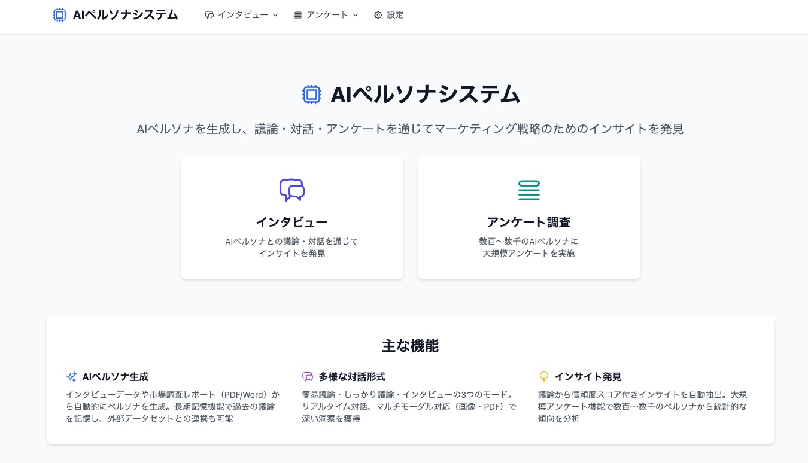

# AI ペルソナシステム

## 概要
このプロジェクトは Amazon Bedrock を活用し、AIペルソナの構築と、そのAIペルソナをもとにペルソナ同士の議論、インタビューそしてアンケート調査などを通じて商品企画やマーケティング戦略立案のためのインサイトを生成するためのサンプル実装です。



## セットアップ
### AWS 上へのデプロイ

[AWS CDK を利用したデプロイ手順](./cdk/README.md)を参照ください。

### ローカル環境でのアプリケーション起動
#### 前提条件
- Python 3.13+、[uv](https://docs.astral.sh/uv/)
- バックエンドリソース（DynamoDB、S3、AgentCore Memory）がAWS CDKで構築済み
- AWS認証情報（Bedrock、DynamoDB、S3へのアクセス）

#### ローカルでの起動手順
```bash
# 1. 依存関係のインストール
uv sync

# 2. 環境変数を設定（.env.exampleを参考に実際の値を記入）
cp .env.example .env
# .env を編集してAWSリソース名等を設定

# 3. Tailwind CSSビルド
./scripts/build-css.sh --minify

# 4. アプリケーション起動
uv run python run_htmx.py
```

ブラウザで http://localhost:8000 にアクセス

## 主要機能

### 🎙️ インタビュー

AIペルソナとの議論・対話を通じてインサイトを発見します。

| ステップ | 機能 | 概要 |
|---------|------|------|
| 1 | **ペルソナ生成** | インタビュー、調査レポート、レビュー、購買データなど多様なデータ＋自然言語の指示でAIペルソナを自動生成 |
| 2 | **ペルソナ管理** | ペルソナの編集・削除、長期記憶（AgentCore Memory）、知識・外部データの管理 |
| 3 | **議論設定** | ペルソナを選択し、3つのモードで議論・インタビューを実行 |
| 4 | **議論結果** | インサイト確認（信頼度スコア付き）、カスタムカテゴリー、レポート生成、過去議論の検索 |

**議論モード:**

| モード | 処理時間 | ペルソナ数 | 特徴 |
|--------|---------|-----------|------|
| 簡易議論 | 3-5分 | 2-5体 | 高速な意見収集 |
| しっかり議論 | 5-15分 | 2-5体 | エージェント駆動の深い議論。長期記憶対応 |
| インタビュー | リアルタイム | 1-5体 | ペルソナとの直接チャット。長期記憶対応 |

### 📊 アンケート調査

数百〜数千のAIペルソナに大規模アンケートを実施します。

| ステップ | 機能 | 概要 |
|---------|------|------|
| 1 | **ペルソナデータ設定** | オープンデータセット（Nemotron）のDLや自社顧客データ（CSV）のアップロード・カラムマッピング |
| 2 | **テンプレート管理** | 選択式・自由記述・スケール評価の質問作成、画像添付 |
| 3 | **アンケート開始** | ペルソナデータソース選択、属性フィルタ、サンプリング数、アンケートジョブ開始 |
| 4 | **結果表示** | CSVダウンロード、ビジュアル分析（棒グラフ）、AIインサイトレポート |

詳細な使用方法は [ユーザーガイド](docs/user_guide.md) を参照してください。

## 技術スタック

| カテゴリ | 技術 |
|---------|------|
| 言語・フレームワーク | Python 3.13, FastAPI, htmx, Jinja2, Tailwind CSS, Alpine.js |
| AI | Amazon Bedrock (Claude Sonnet 4.5 / Haiku 4.5), Strands Agent SDK |
| データ | DynamoDB, DuckDB, Polars, S3 |
| インフラ | AWS CDK (TypeScript), ECS Express Mode, CloudFront, Lambda@Edge, WAF, ECR, Cognito |
| リアルタイム | Server-Sent Events (SSE) |

## テスト

```bash
uv sync --extra dev
uv run pytest                          # 全テスト
uv run pytest -m unit                  # 単体テスト（マーカー指定）
uv run pytest -m integration           # 統合テスト（マーカー指定）
uv run pytest -m api                   # APIテスト（マーカー指定）
uv run pytest --cov=src --cov-report=html  # カバレッジ付き
```

## 開発

```bash
uv sync --extra dev
uv run ruff check .          # リント
uv run ruff check --fix .    # 自動修正
uv run mypy src/ web/             # 型チェック
```

<details>
<summary>プロジェクト構造</summary>

```
ai-persona-system/
├── run_htmx.py             # 起動スクリプト
├── web/                    # フロントエンド
│   ├── main.py            # FastAPIアプリケーション
│   ├── routers/           # APIルーター（persona, discussion, interview, survey, settings, api）
│   ├── templates/         # Jinja2テンプレート
│   └── static/            # 静的ファイル（CSS/JS）
├── src/
│   ├── managers/          # ビジネスロジック層
│   ├── services/          # 外部サービス連携層（AI, DB, S3, Memory, Survey）
│   ├── models/            # データモデル
│   ├── database/          # データベース管理
│   └── config.py          # 設定管理
├── cdk/                   # AWS CDKインフラストラクチャコード
├── tests/                 # テストコード（unit, integration, api）
├── docs/                  # ドキュメント
├── scripts/               # ユーティリティスクリプト
└── sample_data/             # サンプルデータセット
```

</details>

<details>
<summary>テスト構成</summary>

```
tests/
├── conftest.py        # 共通フィクスチャ（DB、モデル、モック）
├── unit/              # 単体テスト（外部依存をモック）
├── integration/       # 統合テスト（モックDB、AIモック）
└── api/               # APIエンドポイントテスト
```

</details>

## ドキュメント

| 対象 | ドキュメント |
|------|------------|
| ユーザー向け | [ユーザーガイド](docs/user_guide.md)  |
| 開発者向け | [CDKデプロイガイド](cdk/README.md) |

## トラブルシューティング

詳細は [トラブルシューティングガイド](docs/troubleshooting_guide.md) を参照してください。

| 問題 | 対処 |
|------|------|
| AWS認証エラー | `aws sts get-caller-identity` で認証情報を確認 |
| ファイルアップロードエラー | 対応形式（.txt, .md）・サイズ上限（10MB）を確認 |
| データベースエラー | `uv run python src/database/create_dynamodb_tables.py` でテーブル再作成 |
| 長期記憶が動作しない | `ENABLE_LONG_TERM_MEMORY=true` と各Memory IDの設定を確認 |
| CDKデプロイエラー | `cd cdk && npm install` → `npx cdk bootstrap` を確認 |

## Citation
This project uses nvidia/Nemotron-Personas-Japan, licensed under CC BY 4.0.
https://creativecommons.org/licenses/by/4.0/

```
@software{nvidia/Nemotron-Personas-Japan,
  author = {Fujita, Atsunori and Gong, Vincent and Ogushi, Masaya and Yamamoto, Kotaro and Suhara, Yoshi and Corneil, Dane and Meyer, Yev},
  title = {{Nemotron-Personas-Japan}: Synthetic Personas Aligned to Real-World Distributions},
  month = {September},
  year = {2025},
  url = {https://huggingface.co/datasets/nvidia/Nemotron-Personas-Japan}
}
```

## Security

See [CONTRIBUTING](CONTRIBUTING.md#security-issue-notifications) for more information.

## License

This library is licensed under the MIT-0 License. See the LICENSE file.

