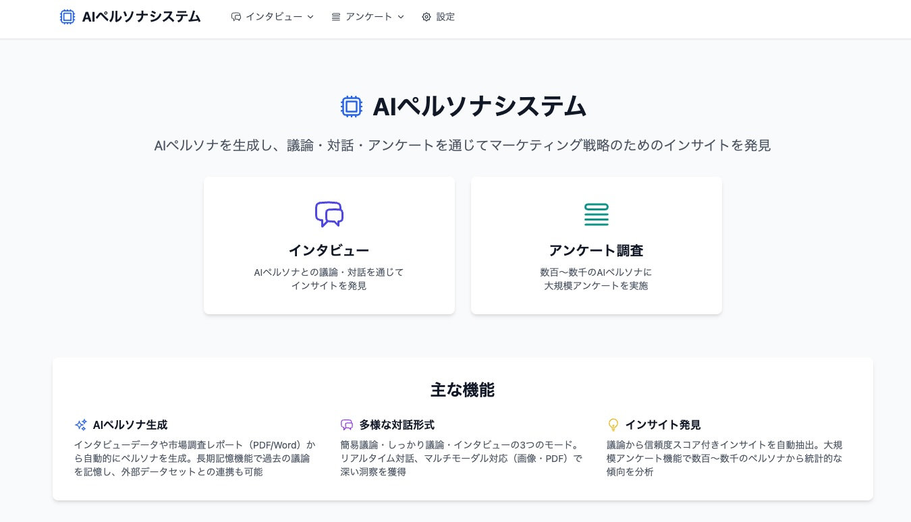
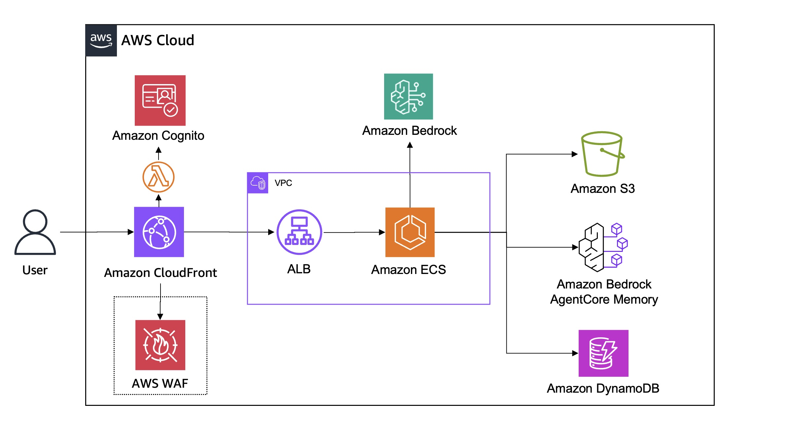

# AI ペルソナシステム

## 概要
このプロジェクトは Amazon Bedrock を活用し、AIペルソナの構築と、そのAIペルソナをもとにペルソナ同士の議論、インタビューそしてアンケート調査などを通じて商品企画やマーケティング戦略立案のためのインサイトを生成するためのサンプル実装です。



## セットアップ
### AWS 上へのデプロイ

- [AWS CDK を利用したデプロイ手順](./cdk/README.md)
- [AWS Generative AI Solution Box からのワンクリックデプロイ](https://aws-samples.github.io/sample-one-click-generative-ai-solutions/solutions/ai-persona/)

### ローカル開発

コードのカスタマイズやローカルでの動作確認を行う場合は [ローカル開発ガイド](docs/local_development.md) を参照してください。

## 主要機能

### インタビュー

AIペルソナとの議論・対話を通じてインサイトを発見します。

| ステップ | 機能 | 概要 |
|---------|------|------|
| 1 | **ペルソナ生成** | インタビュー、調査レポート、レビュー、購買データなど多様なデータ＋自然言語の指示でAIペルソナを自動生成 |
| 2 | **ペルソナ管理** | ペルソナの編集・削除、長期記憶、知識・外部データの管理 |
| 3 | **議論設定** | ペルソナを選択し、議論・インタビューを実行 |
| 4 | **議論結果** | 過去議論の検索、インサイト確認、レポート生成 |

**議論モード:**

| モード | 処理時間 | ペルソナ数 | 特徴 |
|--------|---------|-----------|------|
| 簡易議論 | 3-5分 | 2-5体 | 高速な意見収集 |
| しっかり議論 | 5-15分 | 2-5体 | エージェント駆動の深い議論。 |
| インタビュー | リアルタイム | 1-5体 | ペルソナとの直接チャット。 |

### アンケート調査

数百〜数千のAIペルソナに大規模アンケートを実施します。

| ステップ | 機能 | 概要 |
|---------|------|------|
| 1 | **ペルソナデータ設定** | オープンデータセット（Nemotron）のDLやカスタムデータセットリスト（CSV）のアップロード |
| 2 | **テンプレート管理** | 選択式・自由記述・スケール評価の質問作成、画像添付、AIチャットでの設問ドラフト自動生成 |
| 3 | **アンケート開始** | ペルソナデータソース選択、属性フィルタ、サンプリング数、アンケートジョブ開始 |
| 4 | **結果表示** | CSVダウンロード、ビジュアル分析（棒グラフ）、AIインサイトレポート生成 |

詳細な使用方法は [ユーザーガイド](docs/user_guide.md) を参照してください。

## アーキテクチャ



## 技術スタック

| カテゴリ | 技術 |
|---------|------|
| 言語・フレームワーク | Python 3.13, FastAPI, htmx, Jinja2, Tailwind CSS, Alpine.js |
| AI | Amazon Bedrock (Claude Sonnet 4.6 / Haiku 4.5), Strands Agent SDK |
| インフラ | AWS CDK (TypeScript), ECS Express Mode, CloudFront, Lambda@Edge, WAF, ECR, Cognito |


## 他ソリューションとの連携オプション

AI ペルソナシステムは、他の AWS ソリューションと連携することで機能を拡張できます。

| 連携先 | 概要 | 詳細 |
|--------|------|------|
| [sample-text2sql-agent](https://github.com/aws-samples/sample-text2sql-agent) | 自社の業務知識を持ったデータ分析エージェントと連携し、多様な業務データに基づいたペルソナ生成やディスカッションレポートの作成が可能に | [連携ガイド](docs/data_agent_integration.md) |
| [Amazon Quick](https://aws.amazon.com/jp/quick/) | AI ペルソナシステムの主要機能（ペルソナ生成、議論シミュレーション、インサイト生成）を MCP ツールとして利用する AIエージェントを構築し、リサーチ業務を高度化 | [連携ガイド](docs/remote_mcp_setup.md#amazon-quick-との連携) |

## ドキュメント

| 対象 | ドキュメント |
|------|------------|
| ユーザー向け | [ユーザーガイド](docs/user_guide.md)  |
| 開発者向け | [CDKデプロイガイド](cdk/README.md) |
| 開発者向け | [ローカル開発ガイド](docs/local_development.md) |
| 共通 | [データ分析エージェント連携ガイド](docs/data_agent_integration.md) |
| 共通 | [AI ペルソナ MCP Server 設定ガイド](docs/remote_mcp_setup.md) |

## トラブルシューティング

[トラブルシューティングガイド](docs/troubleshooting_guide.md) を参照してください。

## Citation
This project uses nvidia/Nemotron-Personas-Japan, licensed under CC BY 4.0.
https://creativecommons.org/licenses/by/4.0/

```
@software{nvidia/Nemotron-Personas-Japan,
  author = {Fujita, Atsunori and Gong, Vincent and Ogushi, Masaya and Yamamoto, Kotaro and Suhara, Yoshi and Corneil, Dane and Meyer, Yev},
  title = {{Nemotron-Personas-Japan}: Synthetic Personas Aligned to Real-World Distributions},
  month = {September},
  year = {2025},
  url = {https://huggingface.co/datasets/nvidia/Nemotron-Personas-Japan}
}
```

## Security

See [CONTRIBUTING](CONTRIBUTING.md#security-issue-notifications) for more information.

## License

This library is licensed under the MIT-0 License. See the LICENSE file.

