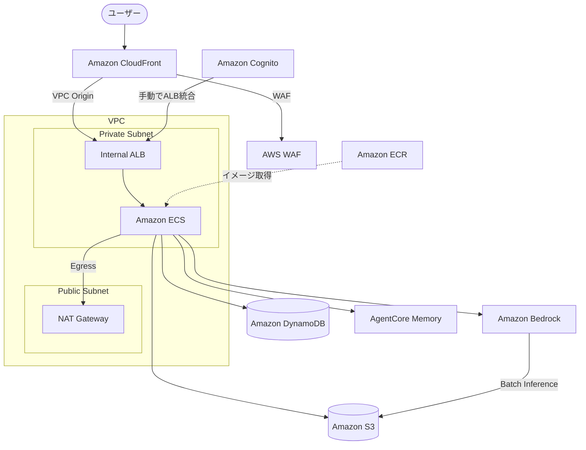

# AI ペルソナシステムの AWS CDK デプロイについて

AI ペルソナシステムをAWSにデプロイするためのCDKコードです。ECS Express Modeを使用してシンプルにデプロイします。

## アーキテクチャ



### セキュリティ構成

- **CloudFront + WAF**: インターネットからの唯一のアクセスポイント。レートリミット + AWSマネージドルール（prod環境のみWAF有効）
- **VPC Origin**: CloudFrontからInternal ALBへのプライベート接続
- **Private Subnet**: ECSタスクにパブリックIPなし
- **Internal ALB**: Express Modeが自動管理（ACM証明書 + HTTPSリスナー自動作成）
- **Cognito認証**: ALBリスナールールに手動設定（Express Modeの制約）

## Stack構成

| Stack ID | 説明 | 依存関係 |
|----------|------|----------|
| AIPersonaMemory-{env} | AgentCore Memory（長期記憶） | なし |
| AIPersonaEcr-{env} | ECRリポジトリ | なし |
| AIPersona-{env} | VPC + DynamoDB + ECS Express + CloudFront + WAF | AIPersonaEcr |
| AIPersonaCognito-{env} | Cognito User Pool | AIPersona |

## 開発環境
- Docker（Docker buildにはx86環境推奨）
- Node.js（CDKの実行に必要）
- Python 3.13以上
- AWS CLI
- uvパッケージマネージャ

AWSのCloudshellを使ってDockerイメージのビルドやプッシュ、CDKでのデプロイが行えます。

## デプロイ順序

```
AIPersonaEcr → (Docker Push) → AIPersonaMemory (手動でIDを取得) → AIPersona → AIPersonaCognito
```

**重要**: ECRとDockerイメージのプッシュ後、AgentCoreMemoryStackをデプロイし、出力されたMemory IDとStrategy IDを`parameters.ts`に設定してから、メインスタックをデプロイしてください。

## パラメータ

| パラメータ名 | 説明 |
|-------------|------|
| envName | 環境名（dev/prod） |
| dynamoDbTablePrefix | DynamoDBテーブルのプレフィックス |
| cognitoDomainPrefix | Cognitoドメインのプレフィックス |
| containerCpu | タスクのCPU（"256", "512", "1024", "2048", "4096"） |
| containerMemory | タスクのメモリ（"512", "1024", "2048", etc.） |
| enableWaf | CloudFront WAFの有効化（dev: false / prod: true） |
| agentCoreMemoryId | AgentCore MemoryのID（AgentCoreMemoryStackから取得） |
| summaryMemoryStrategyId | Summary戦略のID（AWS CLIで取得） |
| semanticMemoryStrategyId | Semantic戦略のID（AWS CLIで取得、知識・事実機能用） |
| agentCoreMemoryEventExpiryDays | イベント保持期間（日数、デフォルト: dev=30 / prod=90） |
| bedrockModelId | Bedrock AIモデルID |
| agentModelId | Agent用モデルID |
| batchInferenceModelId | マスアンケート用バッチ推論モデルID |
| surveyS3Prefix | アンケート結果CSV保存先S3プレフィックス |
| batchInferenceS3Prefix | バッチ推論入出力S3プレフィックス |

## CloudShellとスクリプトによる自動デプロイ

CDKやDockerの知識や環境がなくても、AWS CloudShellとデプロイスクリプトを利用して、デプロイを行う。

### 前提条件

- AWSマネジメントコンソールにログイン済み
- 適切なIAM権限を持つアカウント（CDKでアプリをデプロイするための権限が必要）

### 手順

#### 1. CloudShellを開く

1. AWSマネジメントコンソール右上の CloudShell アイコンをクリック
2. デプロイ先のリージョン（例: `us-east-1`, `us-west-2`, `ap-northeast-1`）が選択されていることを確認

#### 2. デプロイ実行

```bash
git clone https://github.com/aws-samples/sample-ai-persona.git
cd sample-ai-persona
chmod +x deploy.sh
./deploy.sh --region <AWS_REGION>
```

> デフォルトのデプロイ先は `us-east-1` です。他のリージョンにデプロイする場合は `--region` を指定してください（例: `--region us-west-2`, `--region ap-northeast-1`）。

全自動で ECR → Docker ビルド → AgentCore Memory → DynamoDB + ECS → Cognito がデプロイされます。

> **注意**: Cognito認証のALB統合は手動設定が必要です。デプロイ完了後に表示される手順に従ってください。
- デプロイ後、ECS Express Modeで自動作成されたALBのリスナールールにCognito認証を紐づけます。
- ALBのセキュリティグループのアウトバウンド通信を「HTTPS、Anywhere-IPv4」で追加します。
- セルフサインアップはデフォルト有効。不要な場合は、Cognitoユーザプールの設定で「サインアップ」を無効にするのを推奨

#### オプション

```bash
# 長期記憶機能をスキップ（シンプルに使いたい場合）
./deploy.sh --skip-memory

# Cognito認証をスキップ（テスト用）
./deploy.sh --skip-cognito

# 両方スキップ
./deploy.sh --skip-memory --skip-cognito

```

#### コード更新時の再デプロイ

- **(注意)更新前にALBとCognitoの紐付けを一度解除する必要があります。** ECSサービスの再デプロイに失敗します。
- Cognitoは作成済みの場合はスキップしてください。

```bash
cd sample-ai-persona
git pull
chmod +x deploy.sh

# 1. AWSコンソールでALBのCognito認証ルールを一時解除
# 2. デプロイ実行
./deploy.sh --skip-cognito --region <AWS_REGION>
# 3. デプロイ完了後、ALBのCognito認証ルールを再設定
```
- アプリケーションのみの変更の場合、新しいDockerイメージがECRにPUSHされます。
- ECS Express Modeで新しいコンテナイメージに更新し、再度デプロイすることでアプリケーションが更新されます。
- CloudFrontの設定変更がある場合、反映に数分かかることがあります。

### 環境削除

デプロイした環境を完全に削除するには、`destroy.sh`を使用します。

```bash
chmod +x destroy.sh
./destroy.sh --region <AWS_REGION>
```

スタックの依存関係に基づき、正しい順序（Cognito → Main → Memory → ECR）で自動削除されます。
dev環境ではS3バケットの中身は `autoDeleteObjects` により自動削除されます。

#### オプション

```bash
# 確認プロンプトをスキップ
./destroy.sh --force

# 環境名・リージョンを指定
./destroy.sh --env prod --region us-west-2
```


---

## 手動デプロイ手順

以下は、スクリプトを使わずに手動でCDKを利用し、デプロイする場合の手順です。

### 1. 依存関係のインストール

```bash
cd cdk
npm install
```

### 2. パラメータの初期設定

`parameters.ts`を編集して環境に合わせた基本設定を行います。
この時点では、AgentCore MemoryのIDは空文字列のままで構いません。

**重要: cognitoDomainPrefixの設定**

`cognitoDomainPrefix`はAWS全体でグローバルに一意である必要があります。デフォルト値のままだと他のユーザーと重複してデプロイに失敗する可能性があるため、末尾にランダムな文字列などを付与してください。

```typescript
// 例: ランダム文字列を付与
cognitoDomainPrefix: 'ai-persona-dev-abc123xyz',
```

### 3. CDK Bootstrap（初回のみ）

```bash
npx cdk bootstrap aws://<ACCOUNT_ID>/<AWS_REGION>
```

### 4. ECR Stackのデプロイ

```bash
npx cdk deploy AIPersonaEcr-dev
```

### 5. Dockerイメージのビルド・プッシュ
作成したECRレポジトリの「プッシュコマンドを表示」で表示されるコマンドを実行します。（下記は例です。）

```bash
cd ..

# ECRログイン
aws ecr get-login-password --region <AWS_REGION> | docker login --username AWS --password-stdin <ACCOUNT_ID>.dkr.ecr.<AWS_REGION>.amazonaws.com

# ビルド
docker build -t ai-persona .
# ※ Apple Silicon Mac上でビルドする場合は以下のように--platform linux/amd64をつける
docker build --platform linux/amd64 -t ai-persona .

# タグ付け
docker tag ai-persona:latest <ECR_REPOSITORY_URI>:latest

# プッシュ
docker push <ECR_REPOSITORY_URI>:latest
```

### 6. AgentCore Memory Stackのデプロイ（長期記憶を使用する場合）

**長期記憶機能を使用しない場合は、このステップをスキップして手順7に進んでください。**

#### 6-1. Memory Stackのデプロイ

```bash
cd cdk
npx cdk deploy AIPersonaMemory-dev
```

デプロイが完了すると、以下の出力が表示されます：

```
Outputs:
AIPersonaMemory-dev.MemoryId = memory_ai_persona-XXXXXXXXXX
AIPersonaMemory-dev.GetStrategyIdCommand = aws bedrock-agentcore-control get-memory --memory-id memory_ai_persona-XXXXXXXXXX --region <AWS_REGION> --query 'memory.strategies[?type==`SUMMARIZATION`].strategyId' --output text
AIPersonaMemory-dev.GetSemanticStrategyIdCommand = aws bedrock-agentcore-control get-memory --memory-id memory_ai_persona-XXXXXXXXXX --region <AWS_REGION> --query 'memory.strategies[?type==`SEMANTIC`].strategyId' --output text
AIPersonaMemory-dev.NextSteps = IMPORTANT: After deployment, run "aws bedrock-agentcore-control get-memory --memory-id <MEMORY_ID>" to get the Strategy ID, then update parameters.ts
```

#### 6-2. Strategy IDの取得

出力された`GetStrategyIdCommand`と`GetSemanticStrategyIdCommand`を実行して、各Strategy IDを取得します：

**Summary Strategy ID:**
```bash
aws bedrock-agentcore-control get-memory \
  --memory-id memory_ai_persona-XXXXXXXXXX \
  --region <AWS_REGION> \
  --query 'memory.strategies[?type==`SUMMARIZATION`].strategyId' \
  --output text
```

出力例：
```
summary-cGiRRh8umv
```

**Semantic Strategy ID:**
```bash
aws bedrock-agentcore-control get-memory \
  --memory-id memory_ai_persona-XXXXXXXXXX \
  --region <AWS_REGION> \
  --query 'memory.strategies[?type==`SEMANTIC`].strategyId' \
  --output text
```

出力例：
```
semantic-XYZ1234abc
```

#### 6-3. parameters.tsの更新

取得したIDを`parameters.ts`に設定します：

```typescript
export const devParameter: AppParameter = {
  // ...
  agentCoreMemoryId: 'memory_ai_persona-XXXXXXXXXX',  // 6-1で取得したMemory ID
  summaryMemoryStrategyId: 'summary-cGiRRh8umv',      // 6-2で取得したSummary Strategy ID
  semanticMemoryStrategyId: 'semantic-XYZ1234abc',    // 6-2で取得したSemantic Strategy ID
};
```

**長期記憶を使用しない場合**は、空文字列を設定します：

```typescript
export const devParameter: AppParameter = {
  // ...
  agentCoreMemoryId: '',
  summaryMemoryStrategyId: '',
  semanticMemoryStrategyId: '',
};
```

### 7. Main Stackのデプロイ

```bash
npx cdk deploy AIPersona-dev
```

### 8. Cognito Stackのデプロイ

Main Stackのサービスエンドポイントを使用してCognitoを設定します。

```bash
npx cdk deploy AIPersonaCognito-dev
```
- デプロイ後、ECS Express Modeで自動作成されたALBのリスナールールにCognito認証を紐づけます。
- ALBのセキュリティグループのアウトバウンド通信を「HTTPS、Anywhere-IPv4」で追加します。
- セルフサインアップはデフォルト有効。不要な場合は、Cognitoユーザプールの設定で「サインアップ」を無効にするのを推奨

### 手動での環境削除

スクリプトを使わずにCDKコマンドで削除する場合

```bash
cd cdk

# 1. Cognito Stack
npx cdk destroy AIPersonaCognito-dev

# 2. Main Stack（S3バケットを先に空にする）
aws s3 rm s3://<BUCKET_NAME> --recursive
npx cdk destroy AIPersona-dev

# 3. Memory Stack
npx cdk destroy AIPersonaMemory-dev

# 4. ECR Stack（イメージを先に削除）
aws ecr batch-delete-image --repository-name ai-persona-dev \
  --image-ids "$(aws ecr list-images --repository-name ai-persona-dev --query 'imageIds[*]' --output json)"
npx cdk destroy AIPersonaEcr-dev
```

> **注意**: S3バケットやECRリポジトリに中身が残っていると削除に失敗します。必ず事前にクリーンアップしてください。

## 出力値

### AIPersonaMemory-{env}
- `MemoryId`: AgentCore Memory ID（parameters.tsに設定）
- `GetStrategyIdCommand`: Summary Strategy IDを取得するAWS CLIコマンド
- `GetSemanticStrategyIdCommand`: Semantic Strategy IDを取得するAWS CLIコマンド
- `NextSteps`: 次のステップの説明

### AIPersonaEcr-{env}
- `RepositoryUri`: ECRリポジトリURI

### AIPersona-{env}
- `CloudFrontDomainName`: CloudFrontドメイン名（アプリケーションのアクセスURL）
- `InternalServiceEndpoint`: Express Mode内部エンドポイント
- `ManagedALBArn`: Express Mode管理ALBのARN（Cognito手動設定用）
- `ManagedListenerArn`: Express Mode管理リスナーのARN（Cognito認証ルール追加用）
- `ManagedCertificateArn`: Express Mode管理ACM証明書のARN
- `PersonasTableName`: DynamoDB Personasテーブル名
- `DiscussionsTableName`: DynamoDB Discussionsテーブル名
- `UploadedFilesTableName`: DynamoDB UploadedFilesテーブル名
- `UploadBucketName`: S3アップロードバケット名
- `SurveyTemplatesTableName`: DynamoDB SurveyTemplatesテーブル名
- `SurveysTableName`: DynamoDB Surveysテーブル名
- `BedrockBatchRoleArn`: Bedrock Batch Inference IAMロールARN

### AIPersonaCognito-{env}
- `UserPoolId`: Cognito User Pool ID
- `UserPoolClientId`: Cognito Client ID
- `CognitoDomainUrl`: Cognito認証URL
- `CallbackUrls`: OAuth Callback URLs（CloudFront + Expressエンドポイント）

## Cognito認証の手動設定

CognitoスタックはUser Poolとクライアントを作成しますが、ALBへの統合は手動で行います：

1. EC2 > Load Balancers でExpress Modeが作成したInternal ALBを確認（`ManagedALBArn`出力値で特定）
2. HTTPSリスナー（`ManagedListenerArn`）のルールにCognito認証アクションを追加
3. 出力された`UserPoolId`、`UserPoolClientId`、`CognitoDomainUrl`を使用
4. ALBのセキュリティグループのアウトバウンド通信を「HTTPS、Anywhere-IPv4」で追加
5. セルフサインアップはデフォルト有効。不要な場合は、Cognitoユーザプールの設定で「サインアップ」を無効にするのを推奨
6. アプリケーションへのアクセスは `CloudFrontDomainName` 出力値のURLを使用

## 注意事項

### 初回デプロイの順序

1. `AIPersonaEcr-{env}` をデプロイ
2. Dockerイメージをビルド・プッシュ
3. `AIPersonaMemory-{env}` をデプロイ（長期記憶を使用する場合）
4. Memory IDとStrategy IDを取得して`parameters.ts`を更新
5. `AIPersona-{env}` をデプロイ
6. `AIPersonaCognito-{env}` をデプロイ

### AgentCore Memory Strategy IDの取得

CloudFormationではStrategy IDを直接取得できないため、AWS CLIを使用して取得する必要があります：

**Summary Strategy ID:**
```bash
aws bedrock-agentcore-control get-memory \
  --memory-id <MEMORY_ID> \
  --region <AWS_REGION> \
  --query 'memory.strategies[?type==`SUMMARIZATION`].strategyId' \
  --output text
```

**Semantic Strategy ID:**
```bash
aws bedrock-agentcore-control get-memory \
  --memory-id <MEMORY_ID> \
  --region <AWS_REGION> \
  --query 'memory.strategies[?type==`SEMANTIC`].strategyId' \
  --output text
```

これらのIDは、namespaceパターンで使用されます：
- Summary: `/strategies/{memoryStrategyId}/actors/{actorId}/sessions/{sessionId}`
- Semantic: `/strategies/{memoryStrategyId}/actors/{actorId}`

### ECS Express Modeの特徴

- Internal ALB、セキュリティグループ、オートスケーリング、ACM証明書を自動管理
- Private Subnetに配置（パブリックIPなし）
- CloudFront VPC Origin経由でインターネットに公開
- 専用VPC（`ai-persona-{env}`）上にデプロイ
- ECSクラスター名: `ai-persona-{env}`
- AWS提供ドメイン名を自動付与（`*.ecs.<region>.on.aws`）

### S3バケットの使用

- ファイルアップロードは自動的にS3バケットに保存されます
- バケット名は環境変数`S3_BUCKET_NAME`として自動設定されます
- ECSタスクロールにS3の読み書き権限が付与されています
- バージョニングが有効化されており、誤削除時の復元が可能です

## ECSサービスのアップデート時の注意
- ECSサービスやAIペルソナメインスタックの更新時、手動で設定したALBのCognito認証ルールを一度外してから、デプロイを行う（リスナールールでCognito統合されている場合、更新時にエラーが出る）
- デプロイ完了後、ALBのCognito認証ルールを再設定する
- CloudFrontの設定変更がある場合、反映に数分かかることがある

## トラブルシューティング

### サービスが起動しない

1. ECRにイメージがプッシュされているか確認
2. CloudWatch Logsでコンテナログを確認
3. タスクロールの権限を確認

### アプリケーションにアクセスすると503エラーがかえってくる
- ALBのリスナー設定でターゲットグループを確認する。タスクが登録されていないターゲットグループにトラフィックが振られていないかを確認する

### Cognito認証エラー

1. CallbackUrlにCloudFrontドメインとExpressエンドポイントの両方が登録されているか確認
2. Cognito Domainがグローバルで一意か確認
3. ALBのリスナールールにCognito認証アクションが正しく設定されているか確認
