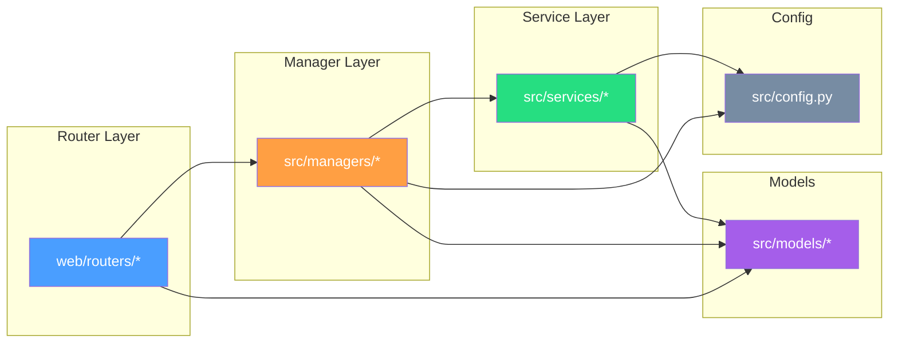
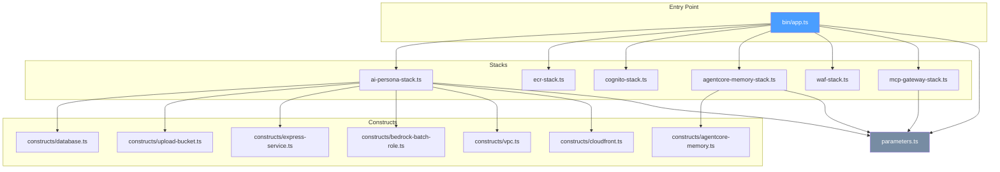
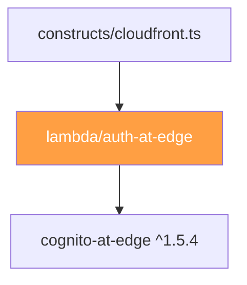
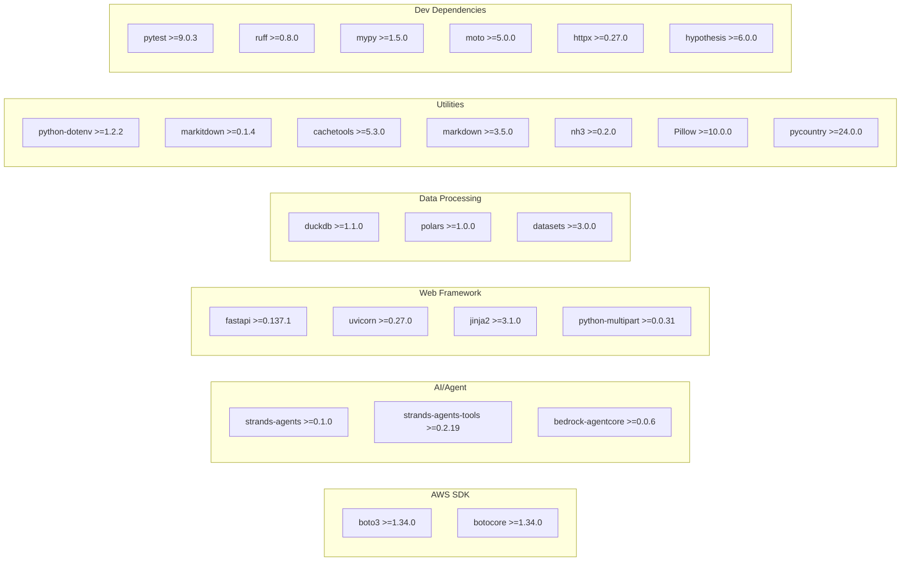

# モジュール依存関係図

## 全体アーキテクチャ

```mermaid
graph TB
    subgraph "Web Layer"
        WM[web/main.py]
        WR_P[web/routers/persona.py]
        WR_D[web/routers/discussion.py]
        WR_I[web/routers/interview.py]
        WR_A[web/routers/api.py]
        WR_S[web/routers/settings.py]
        WR_SV[web/routers/survey.py]
        W_MW[web/middleware.py]
        W_SAN[web/sanitize.py]
        W_PAG[web/routers/_pagination.py]
    end

    subgraph "Manager Layer"
        M_PM[managers/persona_manager.py]
        M_DM[managers/discussion_manager.py]
        M_ADM[managers/agent_discussion_manager.py]
        M_IM[managers/interview_manager.py]
        M_FM[managers/file_manager.py]
        M_JM[managers/job_manager.py]
        M_DSM[managers/dataset_manager.py]
        M_SVM[managers/survey_manager.py]
    end

    subgraph "Service Layer"
        S_AI[services/ai_service.py]
        S_AG[services/agent_service.py]
        S_DB[services/database_service.py]
        S_SF[services/service_factory.py]
        S_S3[services/s3_service.py]
        S_CS[services/country_service.py]
        S_MCP[services/mcp_server_manager.py]
        S_SV[services/survey_service.py]
        S_DA[services/data_agent_service.py]
    end

    subgraph "Memory Subsystem"
        MEM_S[memory/memory_service.py]
        MEM_ST[memory/strategy.py]
        MEM_SUM[memory/summary_strategy.py]
        MEM_SEM[memory/semantic_strategy.py]
        MEM_R[memory/retry.py]
        MEM_SM[memory/session_manager_factory.py]
    end

    subgraph "Models"
        MOD_P[models/persona.py]
        MOD_D[models/discussion.py]
        MOD_M[models/message.py]
        MOD_I[models/insight.py]
        MOD_IC[models/insight_category.py]
        MOD_DR[models/discussion_report.py]
        MOD_J[models/job.py]
        MOD_DS[models/dataset.py]
        MOD_SV[models/survey.py]
        MOD_ST[models/survey_template.py]
        MOD_KB[models/knowledge_base.py]
        MOD_MEM[models/memory.py]
        MOD_DEM[models/demographics.py]
    end

    CFG[src/config.py]

    %% Web → Manager
    WM --> WR_P & WR_D & WR_I & WR_A & WR_S & WR_SV
    WM --> W_MW & W_SAN
    WR_P --> M_PM & M_FM
    WR_D --> M_PM & M_DM & M_ADM & M_FM
    WR_I --> M_PM & M_IM
    WR_A --> M_PM & M_DM & M_ADM & M_IM & M_JM
    WR_S --> M_DSM
    WR_SV --> M_SVM
    WR_P --> W_PAG & W_SAN
    WR_D --> W_PAG & W_SAN
    WR_I --> W_SAN

    %% Manager → Service
    M_PM --> S_AI & S_DB & S_SF & S_CS
    M_DM --> S_AI & S_DB & S_SF
    M_ADM --> S_AG & S_DB & S_SF
    M_IM --> S_AG & S_DB
    M_FM --> S_DB & S_SF
    M_JM --> S_SF
    M_DSM --> S_SF
    M_SVM --> S_AI & S_DB & S_SV

    %% Manager → Manager (例外的)
    M_IM --> M_ADM

    %% Service内部
    S_SF --> S_AI & S_AG & S_DB
    S_AI --> S_CS
    S_AG --> S_CS
    S_SV --> S_AI & S_S3

    %% Memory内部
    MEM_S --> MEM_ST & MEM_SUM & MEM_SEM & MEM_R
    MEM_SUM --> MEM_ST
    MEM_SEM --> MEM_ST & MEM_SUM

    %% Config参照
    S_AI --> CFG
    S_AG --> CFG
    S_SF --> CFG
    M_DM --> CFG
    M_FM --> CFG
    MEM_SM --> CFG

    %% Model参照（代表的なもの）
    M_PM --> MOD_P & MOD_DEM
    M_DM --> MOD_P & MOD_D & MOD_I & MOD_IC & MOD_DR
    M_ADM --> MOD_P & MOD_D & MOD_M
    M_IM --> MOD_P & MOD_D & MOD_M
    M_SVM --> MOD_SV & MOD_ST
    S_DB --> MOD_P & MOD_D & MOD_M & MOD_I
    S_AI --> MOD_P & MOD_M & MOD_IC & MOD_DEM
    S_AG --> MOD_P & MOD_M & MOD_DEM
    MEM_S --> MOD_MEM
    MEM_SUM --> MOD_MEM
    MEM_SEM --> MOD_MEM
    WR_S --> MOD_DS & MOD_KB
```



## Python パッケージ依存関係（レイヤー別）



## CDK スタック依存関係



## CDK Lambda 依存関係



## 外部パッケージ依存関係

### Python (pyproject.toml)



### CDK (package.json)

```mermaid
graph LR
    subgraph "CDK Core"
        CDK_LIB[aws-cdk-lib ^2.260.0]
        CDK_CLI[aws-cdk ^2.1128.1]
        CONSTRUCTS[constructs ^10.4.0]
    end

    subgraph "CDK Alpha"
        AGENTCORE_A[@aws-cdk/aws-bedrock-agentcore-alpha ^2.252.0-alpha.0]
    end

    subgraph "Dev"
        TS[typescript ^5.7.0]
        TS_NODE[ts-node ^10.9.0]
        TYPES_NODE[@types/node ^22.0.0]
    end

    subgraph "Runtime"
        SMS[source-map-support ^0.5.21]
    end
```

## 注意すべき依存パターン

| パターン | 箇所 | 備考 |
|---------|------|------|
| 表示ヘルパー例外 | `persona.py`, `discussion.py` → `country_service` | ISO国コード→名前の純粋なデータ参照。文書化済み例外 |

## 解消済みの依存違反（refactor/architecture-violation ブランチ）

- Router→Service直接参照: persona.py, discussion.py, settings.py, survey.py → すべてManager経由に変更
- Manager間依存: InterviewManager → AgentDiscussionManager 継承 → 独立クラスに変更
- Manager間依存: AgentDiscussionManager/PersonaManager → FileManager → shared/document_loader に抽出
- Service層ビジネスロジック: ai_service.py バリデーション → Manager層に既存のため除去
- Service層ワークフロー制御: FacilitatorAgent の発言者選択・プロンプト構築 → AgentDiscussionManager に移動
